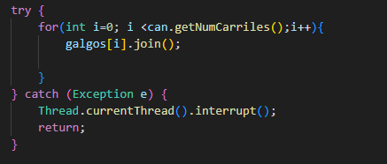

# Lab2-arsw

# Nombre: David Santiago Castro Sierra

Como podremos ver en las siguietes imagines al ejecutar el programa con 30 millones queda full haciendo uso casi del 100% de todos los nucleos (4) y procesadores logicos (8) del equipo con un tiempo de ejucución de 5 minutos y 22 segundos.

Ahora con 3 hilos tarda 41 segundos, ya que modificamos el codigo, sobretodo en el print que tenia ya que esto siempre va a hacer que la ejecucion tome el mismo tiempo, vemos que esta usando los mismo recursos en el caso de 3 hilos, pero tarda mucho menos

En este caso usamos 40 millones donde vemos que conto en 5 segundos: 1353042 con 5 hilos de un total de 2433654

De esta manera arreglamos ese problema ya que ahora espera a que todos los hilos terminen, para mostrar los resultados

Encuentro que al ejecutarlo varias veces el puesto 1 se puede repetir varias veces. Para solucionar esto se tuvo que cambiar dos cosas, la primera es que galgo imprimiera los nombres de las posiciones, mas no que las modificara, ya que se puede crear una funcion sincronizada que asigne los puestos junto con los getGanador y getUltimaPosicionAlcanzada

Para lograr esto construimos una clase para pausar que va a permitir dormir todos los hilos y despertarlos sincronizadamente donde se le notifica a todos y todos esperan, en adicional lo añadimos en galgo para que esere y corra y en las funciones de continue o detengase de main

